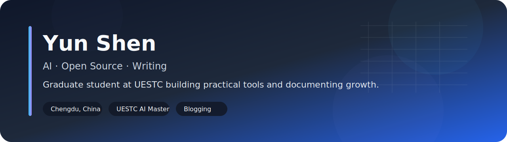
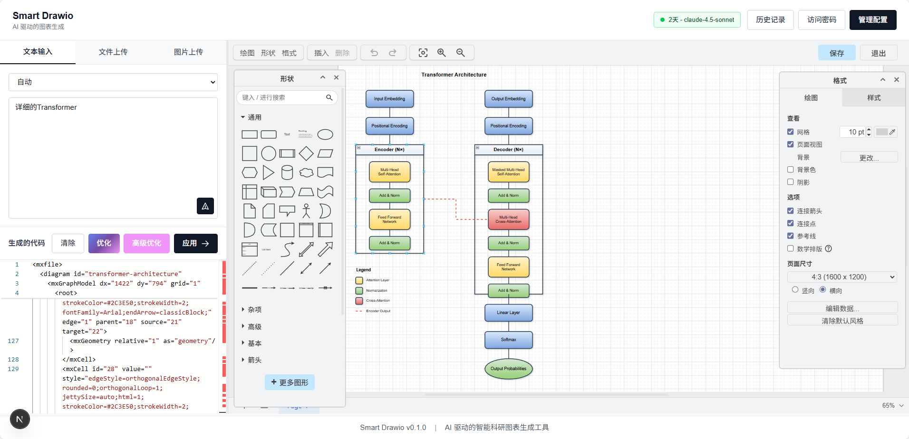
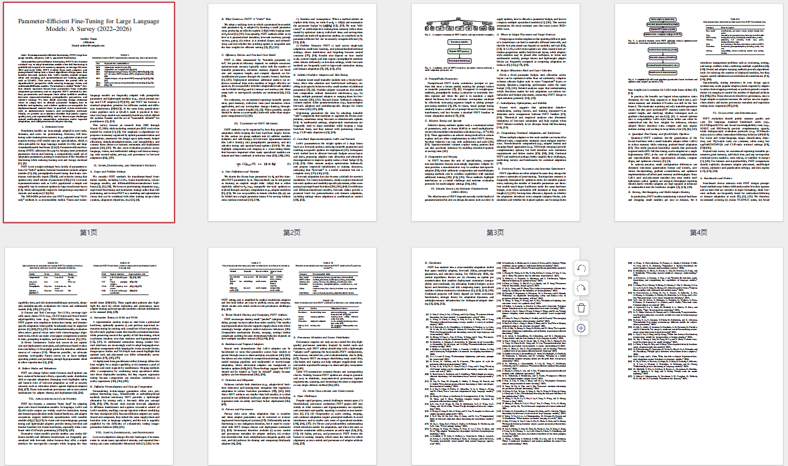
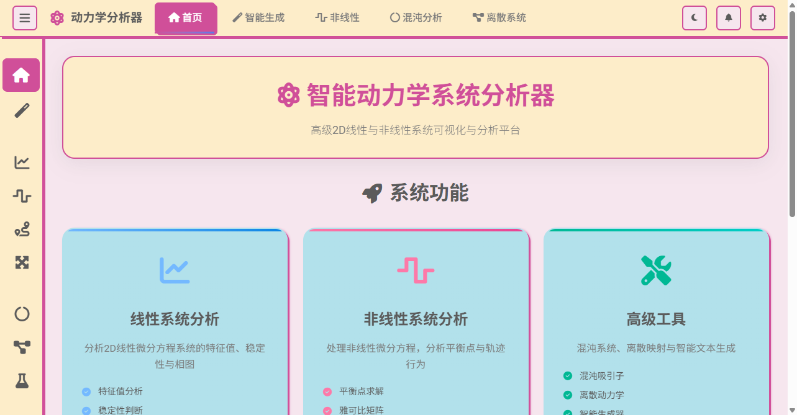
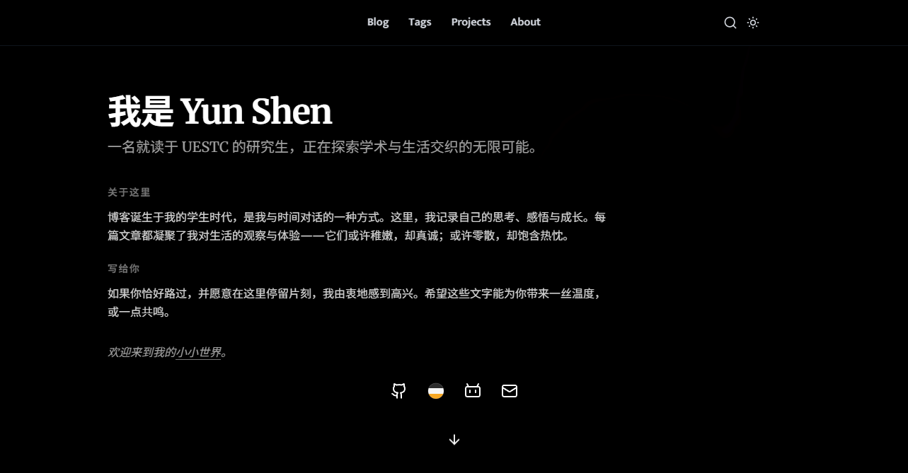
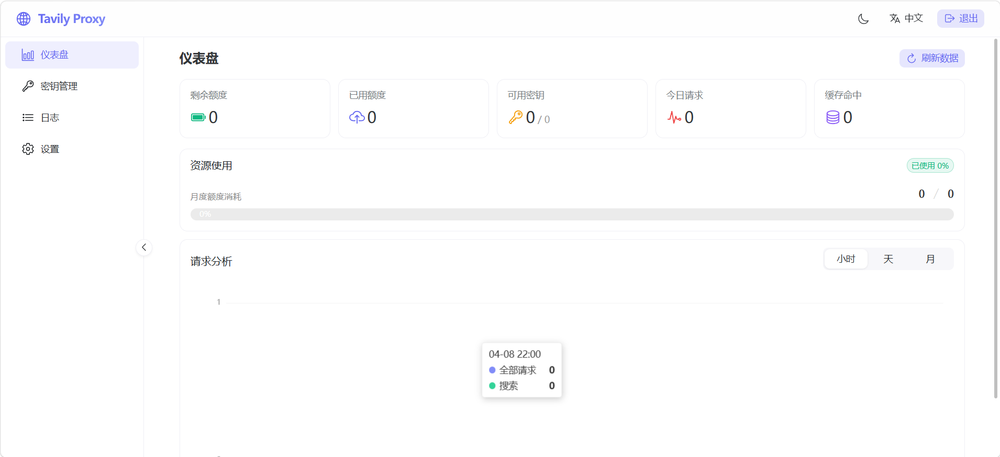

 
 

# Hi there, I'm Yun Shen

A graduate student at UESTC exploring AI, open source, and writing.

  <a href='https://uestc.de5.net/'>Blog</a> ·
  <a href='https://uestc.de5.net/about'>About</a> ·
  <a href='https://uestc.de5.net/projects'>Projects</a> ·
  <a href='https://github.com/yunshenwuchuxun?tab=repositories'>Repos</a>

---

## About Me

- AI master's student based in Chengdu, China
- Interested in AI, deep learning, multimodal systems, and open-source tools
- I write to organize what I learn and to leave a trace of growth over time
- Languages: 中文 / English

## What I'm Doing Now

- Studying and researching in the AI field
- Improving my English through technical reading and papers
- Maintaining my personal blog and documenting what I learn
- Exploring practical open-source projects and developer tooling

## Featured Projects

<table>
<tr>
<td width='50%' valign='top'>

### Smart Drawio
AI-powered Draw.io diagram generator that turns natural language into editable diagrams for research, architecture, and documentation.

</td>
<td width='50%' valign='top'>

### latex-paper-skills
A modular LaTeX skill framework for ML/AI paper writing, covering topic selection, drafting, review, and compilation workflows.

</td>
</tr>
<tr>
<td width='50%' valign='top'>

### Dynamical System Analyzer
An interactive platform for analyzing dynamical systems with visualizations such as phase portraits, chaotic attractors, and bifurcation diagrams.

</td>
<td width='50%' valign='top'>

### Yun Shen Blog
My personal digital garden built with Next.js 16, MDX, smooth animations, and a writing-first workflow.

</td>
</tr>
<tr>
<td width='50%' valign='top'>

### TavilyProxy
A Tavily API proxy and key-pool management platform with unified access, failover, and admin tooling.

</td>
<td width='50%' valign='top'>

### More
More projects and experiments are collected on my projects page.

- [Projects Page](https://uestc.de5.net/projects)
- [GitHub Repositories](https://github.com/yunshenwuchuxun?tab=repositories)

</td>
</tr>
</table>

## GitHub Stats

  
  

  

## Writing

- Blog: [uestc.de5.net](https://uestc.de5.net/)
- About: [uestc.de5.net/about](https://uestc.de5.net/about)
- Projects: [uestc.de5.net/projects](https://uestc.de5.net/projects)

## Connect With Me

  
  
  
  

## Tech Stack

`Python` `PyTorch` `LangChain` `Next.js` `React` `Tailwind CSS` `MDX`

## Notes

To make this work as your real GitHub profile page, copy this folder's contents into the root of a repository named exactly `yunshenwuchuxun`.

